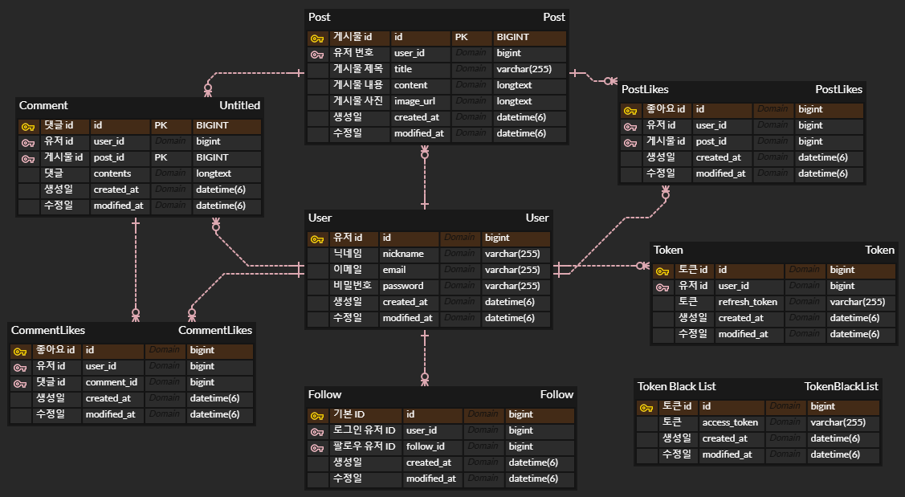
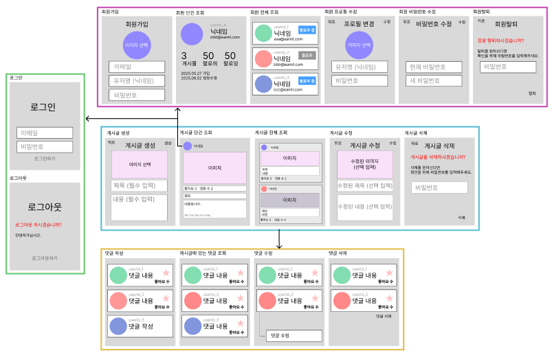

# NewSpeed

### 이름처럼 새 소식을 빠르게!

 

 개발 기간 : 2025.05.27 ~ 2025.06.04

 

## 달성 목표

저희 SNS 서비스는 사용자들이 서로의 일상을 공유하고 소통하며, 자연스럽게 커뮤니티를 형성하는 것을 목표로 합니다

## 팀과 팀원 소개

팀 이름 : 404 (𝑁𝑜𝑡 𝐹𝑜𝑢𝑛𝑑)
뜻 : 예상치 못한 문제도 함께 해결하며 성장하자는 의미를 담고있습니다.

#### 팀장

구대웅 https://github.com/GuDaeWoong

#### 팀원

우지운 https://github.com/Zyooon 
박민철 https://github.com/syuare-dev 
우새빛 https://github.com/saevit 
김현찬 https://github.com/4ouChan

#### 커밋규칙
- Feat: 구현내용 요약 - 새로운 기능 추가 시
- Fix: 수정내용 요약 - 버그 수정 시
- Rename: 이전 파일명 -> 바꾼 파일명 - 파일 이름 변경 시
- Remove: 삭제한 파일명 - 파일 삭제 시
- Refactor: 리팩토링한 내용 - 코드 리팩토링 시
- Comment: 주석 추가한 내용 - 주석 추가 또는 수정 시

### 개발환경

| 제목           | 내용                   |
|----------------|------------------------|
| 언어           | Java 17                |
| 프레임워크      | Spring Boot 3.5.0      |
| 개발 환경      | IntelliJ IDEA          |
| 데이터베이스    | MySQL (JDBC Driver)    |
| ORM            | Spring Data JPA        |
| 보안           | JWT (jjwt 0.11.5), 비밀번호 암호화 (spring-security-crypto) |
| 빌드 도구      | Gradle                 |
| 라이브러리      | Lombok                 |
| API 테스트      | Postman                |

 

##  시작 가이드
### ERD

 

### Wireframe

 

### JWT 필터 설계

 

## API 문서

 
https://www.notion.so/teamsparta/API-2002dc3ef51480eaaca1d447b8acd59d
 

## 1. 프로필 관리

- 프로필 조회기능

- 프로필 수정기능
  - 로그인한 사용자는 본인의 사용자 정보를 수정

- 비밀번호 수정조건
  1. 비밀번호 수정 시, 본인 확인을 위해 현재 비밀번호를 입력하여 올바른 경우에만 수정
  2. 현재 비밀번호와 동일한 비밀번호로 수정 불가
  - 조건이 만족하지 않는 경우 예외처리

## 2. 뉴스피드 게시물 관리

- 게시물 작성, 조회, 수정, 삭제 기능

- 게시물 수정, 삭제 조건
  - 작성자 본인만 처리할 수 있다
  - 직성자가 아닌 다른 사용자가 게시물 수정, 삭제 시도할 경우 예외처리

- 뉴스피드 조회 기능
  - 기본 정렬은 생성일자 기준으로 내림차순 정렬
  - 10개씩 페이지네이션

## 3. 사용자 인증

- 회원가입 기능
  - 사용자 아이디: email 형식
  - 비밀번호: Bcrypt 로 인코딩
  - 비밀번호 조건: 대소문자 포함 영문 + 숫자 + 특수문자를 최소 1글자씩 포함, 최소 8글자 이상
  - 예외처리 : 중복된 사용자 아이디로 가입하는 경우, 이메일과 비밀번호 형식이 올바르지 않은 경우

- 회원 탈퇴 기능
  - 탈퇴 처리 시 비밀번호 검증
  - 탈퇴한 사용자의 아이디는 재사용 불가
  - 예외처리 : 사용자 아이디와 비밀번호가 일치하지 않는 경우, 이미 탈퇴한 사용자 아이디인 경우

## 4. 친구 관리

  - 특정 사용자를 팔로우 할 수 있음
  - 뉴스피드에 내가 팔로우한 사람의 게시물들을 최신순으로 볼 수 있음

## 5. 검색 및 정렬 기능

- 수정일자 기준 최신순
- 기간별 검색 기능

## 6. 댓글

- 댓글 작성, 조회, 수정, 삭제
- 사용자는 게시물에 댓글을 작성할 수 있고, 본인의 댓글을 수정 및 삭제할 수 있음
- 댓글 수정시 내용만 수정 가능
- 댓글 삭제는 댓글 작성자와 게시글 작성자만 수정가능
- 댓글 수정은 댓글의 작성자만 가능

## 7. 좋아요

- 게시물 및 댓글 좋아요/좋아요 취소 기능
  - 사용자가 게시물이나 댓글에 좋아요를 남기거나 취소할 수 있음
  - 본인이 작성한 게시물과 댓글에 좋아요를 남길 수 없음
  - 같은 게시물에는 사용자 당 한번만 좋아요가 가능

 
 

### 팀 트러블 슈팅

#### 1. 도메인 간 책임 분리 및 API 설계 일관성 확보

- 문제 상황

초기 API 설계에서 특정 도메인(예: 사용자) 조회 시, 해당 도메인과 관련된 다른 도메인(예: 게시글)의 정보까지 한 번에 반환하도록 설계했습니다. 예를 들어, /users/{id} 요청 시 사용자 정보와 해당 사용자의 모든 게시글 리스트를 함께 반환하는 식이었습니다.

- 문제 원인

이러한 설계는 도메인 간의 책임 범위가 모호해지는 결과를 낳았습니다. 특정 도메인이 다른 도메인의 정보를 너무 많이 포함하게 되면서, 향후 기능 확장이나 유지보수 시 복잡성이 증가할 우려가 있었습니다.

- 해결 방안

도메인 간 책임 분리를 명확히 하여 API 설계를 변경했습니다.

유저 조회 API: 오직 사용자 정보만 반환하도록 재설계했습니다. 게시글과 같은 다른 정보는 별도의 API 요청을 통해 가져오도록 분리했습니다.
이를 통해 각 도메인의 역할과 책임이 명확해져 코드의 응집도를 높이고, 확장 및 유지보수를 용이하게 했습니다.

#### 2. API 및 DTO 명명 규칙 통일

- 문제 상황

개발 초기에는 기본적인 API 명세와 컨벤션을 수립했지만, 팀원별로 기능을 추가하고 각자 작업을 진행하면서 명명 규칙이 일관되지 않게 적용되는 문제가 발생했습니다.

API URL: /api/users, /posts, /api/post 등 다양한 형식이 혼용되었습니다.
DTO 필드명: username, nickname 등 동일한 의미를 다른 표현으로 사용하거나, user, post, comment 등 도메인마다 id 필드가 존재하여 혼란을 야기했습니다.

- 문제 원인

명확하고 구체적인 명명 규칙이 부재했으며, 지속적인 컨벤션 검토 및 공유가 부족했습니다. 이는 코드 가독성을 저해하고 팀원 간의 협업 효율성을 떨어뜨렸습니다.

- 해결 방안

팀원 간의 회의를 통해 다음과 같이 명명 규칙을 통일했습니다.

API URL: 모든 API는 /api/복수형 형태로 통일했습니다 (예: /api/users, /api/posts).
DTO 필드명:
모든 id 필드는 [도메인명]Id 형식으로 통일했습니다 (예: userId, postId).
그 외 필드명은 협의를 통해 혼란이 없도록 통일된 표현을 사용했습니다. 이러한 통일된 규칙 적용을 통해 코드의 일관성과 가독성을 크게 향상시켰습니다.

#### 3. 페이징 처리 방식 표준화

- 문제 상황

각 도메인별로 페이징 처리 방식이 제각각이어서 코드의 일관성이 부족하고, 재사용성이 떨어지는 문제가 발생했습니다.

- 문제 원인

개발 초기 각 팀원이 서로 다른 방식으로 페이징을 구현하면서 점차 스타일이 분산되었고, 이는 공통된 모듈화 전략의 부재를 드러냈습니다.

- 해결 방안

팀원 간의 회의를 통해 다음과 같은 페이징 처리 표준을 수립했습니다.

컨트롤러 파라미터: @PageableDefault 어노테이션을 사용하여 페이징 관련 파라미터를 통일했습니다.
응답 포맷: PageResponseDto<T>라는 공통 DTO를 활용하여 페이지 정보와 실제 데이터 리스트를 함께 반환하도록 표준화했습니다. 이를 통해 페이징 로직의 일관성을 확보하고 재사용성을 증대시켰습니다.

#### 4. 서비스 계층 간 순환 참조 문제 해결

- 문제 상황

서비스 계층에서 특정 도메인 서비스가 다른 도메인 서비스를 필요로 하는 경우가 발생했습니다. 예를 들어, UserService에서 사용자의 게시글 수를 조회하기 위해 PostService를 주입하거나, PostService에서 게시글 작성자의 정보를 가져오기 위해 UserService를 주입하는 식이었습니다.

- 문제 원인

이러한 설계는 서비스 간의 순환 참조(Circular Reference) 오류를 유발하여 애플리케이션 실행이 불가능하게 만들었습니다. 이는 모듈 간의 의존성 관리 부재와 각 서비스의 책임 범위에 대한 명확한 정의 부족에서 비롯되었습니다.

- 해결 방안

순환 참조 문제 해결을 위해 다음과 같은 방법을 우선적으로 적용했습니다.

쿼리 조인 활용: 몇몇 경우에는 서비스 주입 대신, 쿼리에서 JOIN 등을 활용하여 필요한 데이터를 한 번에 가져오도록 구현을 변경했습니다.
이를 통해 서비스 간의 불필요한 의존성을 줄이고, Circular reference 오류를 해결하여 애플리케이션의 안정성을 확보했습니다.
